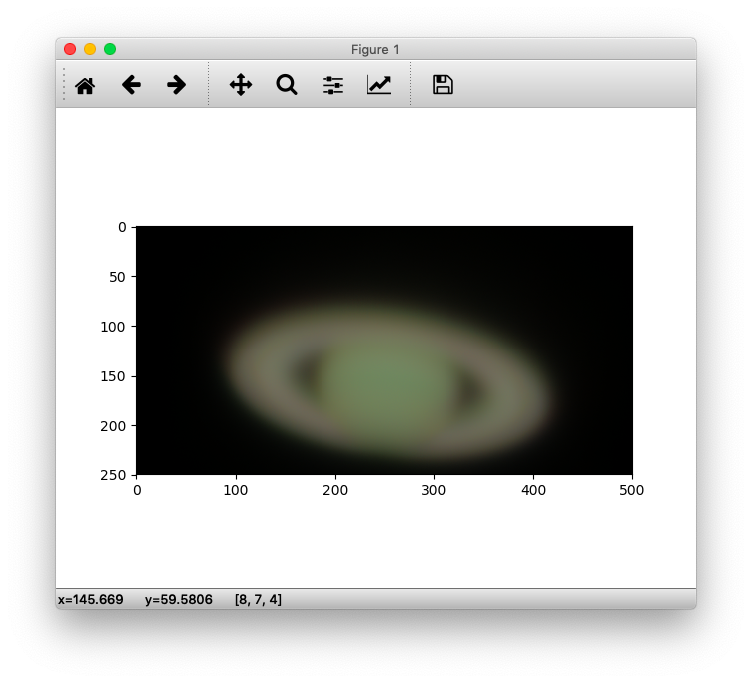

# RGB Composite Practice
Rudimentary code to create a composite image from R, V, and B filter images of Saturn.

## Notes
* [Saturn_05.py](Saturn_05.py) file includes an **absolute file path**.
* Fix this path accordingly to run the script.

